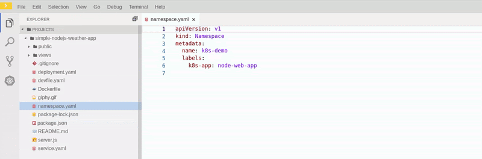

## Try the Kubernetes Plugin Today!

- [Installing chectl](#installing-chectl)
- [Deploying Che 7 into local cluster](#deploying-che-7-into-local-cluster)
- [Creating a Che Workspace](#creating-a-che-workspace)
- [Setting up the access to the local cluster from Che Workspace](#setting-up-the-access-to-the-local-cluster-from-che-workspace)
- [Preparing a namespace](#preparing-a-namespace)
- [Deploying the app to the cluster](#deploying-the-app-to-the-cluster)
- [Checking on the application](#checking-on-the-application)
- [Iterating and deploying a new version](#iterating-and-deploying-a-new-version)

### Installing chectl
[chectl](https://github.com/che-incubator/chectl#chectl) is a command line tool for Eclipse Che 7 that lets us easily deploy upstream Che on [minikube](https://github.com/kubernetes/minikube) with [Helm](https://helm.sh) and manage the Che Workspaces.
chectl is based on [oclif](https://oclif.io/) (made by Heroku), a powerful and extensible open source framework for  building CLIs in Node.js with TypeScript. It is actively used to build the [Heroku](https://devcenter.heroku.com/articles/heroku-cli) and [Salesforce](https://developer.salesforce.com/tools/sfdxcli) CLIs.

Follow the [installation instructions](https://github.com/che-incubator/chectl#installation) to setup `chectl` locally.

### Deploying Che 7 into local cluster
Now, let’s start minikube and Eclipse Che server with the command:

```shell
$ minikube start --memory 4096 --docker-opt userland-proxy=false && chectl server:start
```

`chectl` will perform all the necessary routine to deploy the Che Server nightly build into your local cluster.
If Che Server starts successfully we should get the following output:

```shell
😄  minikube v1.0.0 on linux (amd64)
🤹  Downloading Kubernetes v1.14.0 images in the background ...
🔥  Creating virtualbox VM (CPUs=2, Memory=4096MB, Disk=20000MB) ...
📶  "minikube" IP address is 192.168.99.196
🐳  Configuring Docker as the container runtime ...
    ▪ opt userland-proxy=false
🐳  Version of container runtime is 18.06.2-ce
⌛  Waiting for image downloads to complete ...
✨  Preparing Kubernetes environment ...
🚜  Pulling images required by Kubernetes v1.14.0 ...
🚀  Launching Kubernetes v1.14.0 using kubeadm ... 
⌛  Waiting for pods: apiserver proxy etcd scheduler controller dns
🔑  Configuring cluster permissions ...
🤔  Verifying component health .....
💗  kubectl is now configured to use "minikube"
🏄  Done! Thank you for using minikube!
  ✔ ✈️  Minikube preflight checklist
    ✔ Verify if kubectl is installed
    ✔ Verify if minikube is installed
    ✔ Verify if minikube is running
    ↓ Start minikube [skipped]
      → Minikube is already running.
    ✔ Verify userland-proxy is disabled...done.
    ✔ Verify if minikube ingress addon is enabled
    ↓ Enable minikube ingress addon [skipped]
      → Ingress addon is already enabled.
    ✔ Retrieving minikube IP and domain for ingress URLs...192.168.99.196.nip.io.
  ✔ 🏃‍  Running Helm to install Che
    ✔ Verify if helm is installed
    ✔ Create Tiller Role Binding...done.
    ✔ Create Tiller Service Account...done.
    ✔ Create Tiller RBAC
    ✔ Create Tiller Service...done.
    ✔ Preparing Che Helm Chart...done.
    ✔ Updating Helm Chart dependencies...done.
    ✔ Deploying Che Helm Chart...done.
  ✔ ✅  Post installation checklist
    ✔ Che pod bootstrap
      ✔ scheduling...done.
      ✔ downloading images...done.
      ✔ starting...done.
    ✔ Retrieving Che Server URL...http://che-che.192.168.99.196.nip.io
    ✔ Che status check
Command server:start has completed successfully.
```

### Creating a Che Workspace
Eclipse Che 7 provides a pretty handy way to create a Che Workspace - from a Devfile. [Che Devfile](https://redhat-developer.github.io/devfile/) is a format to define a Che workspace in YAML to bootstrap a cloud developer environment and make it portable.
At first fork [that sample project](https://github.com/azatsarynnyy/simple-nodejs-weather-app) into your own GitHub account in order to have the push permissions for the repo. It’s simple Node.js command line weather application.
Then go to the URL:
`http://<your-che-host>/f?url=<your-git-project-link>`

E.g., in my case it’s the following:
http://che-che.192.168.99.196.nip.io/f?url=https://github.com/azatsarynnyy/simple-nodejs-weather-app

Che will create a Development Workspace based on the definition in devfile.yaml
```yaml
specVersion: 0.0.1
name: k8s-plugin
components:
 - type: cheEditor
   id: 'org.eclipse.che.editor.theia:next'
 - type: chePlugin
   id: 'ms-kubernetes-tools.vscode-kubernetes-tools:0.1.17'
 - type: chePlugin
   id: 'redhat.vscode-yaml:0.3.0'
```


Once the workspace creation completes, Theia editor is loaded and the project README.md file is opened. You will notice the Kubernetes icon on the left sidebar: the VS Code Kubernetes Tools extension is installed. 


### Setting up the access to the local cluster from Che Workspace
In order to access the local Kubernetes cluster from the Che Workspace we need to inject the kubeconfig from the local machine into the Che Workspace. Use a command like the following:

```shell
$ chectl workspace:inject -k
  ✔ Verify if namespace che exists
  ✔ Verify if the workspaces is running
  ✔ Injecting configurations
    ✔ injecting kubeconfig into container theia-ide...done.
    ✔ injecting kubeconfig into container pluginsidecarfdrzzs...done.
    ✔ injecting kubeconfig into container pluginsidecarntachr...done.
```

Once the command is completed minikube should appear in the clusters list. Note that `chectl` won’t inject the entire `kubeconfig` into the Che Workspace but only the information related to accessing the local minikube cluster.


### Preparing a namespace
Let’s create a separate Kubernetes namespace to hold on our work and to not worry about affecting content in the other namespaces. Open the `namespace.yaml` file and execute the `Kubernetes: Apply` command in the Command Palette.


To operate in the created namespace select the `Use Namespace` command from the `k8s-demo` namespace context menu.



### Deploying the app to the cluster
Let’s spin up a deployment and a service of our application to deploy it into the cluster. In the `deployment.yaml` file replace the git repo URL with your forked repo URL.


Then we can boot it up calling the `Kubernetes: Apply` command.


It will clone, build and start the demo application by running a container based on the default Node.js image. Of course this is not recommended approach and the code of our application should be a part of an image but we’re using it here just for simplicity.

We’ve just created a deployment that is running a pod with a container that serves our application. To make the application visible outside the cluster we have to create a Kubernetes service. Call the same command for the `service.yaml` file.


### Checking on the application
To check the running app you need to get it’s URL. You can open a shell on your host and use the command minikube service:

```shell
$ minikube service -n k8s-demo node-web-app
🎉  Opening kubernetes service k8s-demo/node-web-app in default browser...
```

Alternatively you can get the port of the app service using the `Describe` command from the service context menu.


The detailed description of the service will be printed to the editor area. Take the `NodePort` value.


Prepend the cluster IP to the app’s port. In my case it’s 192.168.99.196:32606
Note, your app may not be accessible immediately since it may take some time to download the image by Kubernetes depending on your Internet bandwidth.


### Iterating and deploying a new version
Let’s make some changes and redeploy a new version of our app. Open the `views/index.ejs` file and change for example the button name to `Get Weather Forecast`. To push the new version to GitHub using the `theia-ide` container terminal, hit <kbd>Ctrl+`</kbd> hotkey twice and choose theia-ide container.


Now we need to deploy a newer version of our application into the cluster. Let’s switch back to the `deployment.yaml` file in the editor and call the `Kubernetes: Scale` command. Pass zero number to shut down the pod with the previous app version. And repeat the command with 1 replica passed to start the pod again but with new app version.


After refreshing the page with our app we can get the updated version - with the new button.


